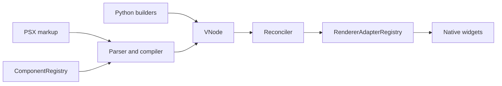
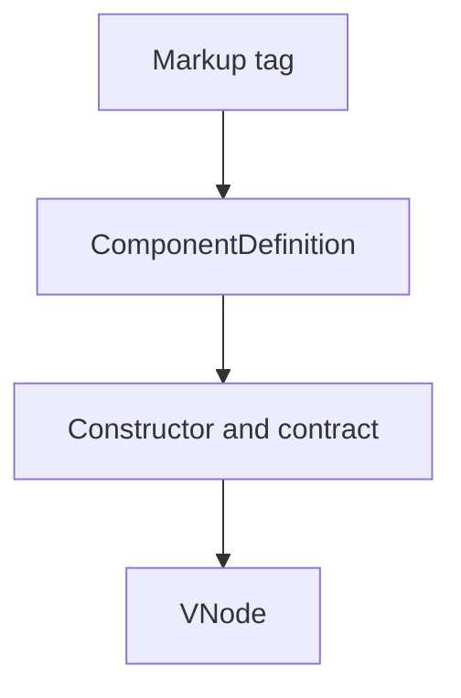
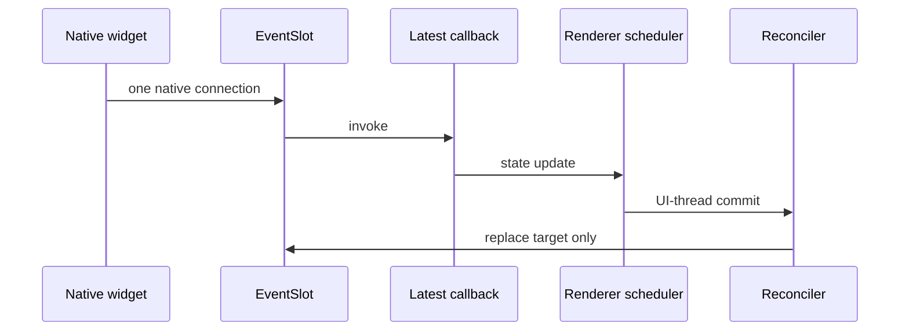

# PSX architecture

PSX separates declarative descriptions from native GUI objects. Python builders and PSX markup create immutable `VNode` values. The reconciler owns identity, hooks, refs, event slots, and cleanup; renderers own native handles and UI-thread scheduling.



## Resolution and contracts

`builtin_component_registry()` returns a fresh registry containing `Column`, `Row`, `Text`, `Button`, `Input`, `Checkbox`, `Fragment`, and `Native`. Built-ins need no registration. External registries are isolated and can add tags such as `acme.Badge`; compilation caches include registry identity and version.

`ComponentContract` is backend-independent metadata for properties, defaults, events, child policy, and validation. It has no Qt, Kivy, or Tkinter dependency. Markup and Python builders produce the same VNode semantics.



## Reconciliation and lifecycle

Nodes with the same `(kind, type, key)` are compatible and retain their native handle. Changed props update in place. Each event uses one stable `EventSlot`; callback changes replace its target without a second native connection. On unmount PSX makes slots inert, disconnects subscriptions, clears refs, disposes effects, then destroys PSX-owned handles.



## Adapters, native widgets, and plugins

Every renderer owns an instance-scoped `RendererAdapterRegistry`. A `ComponentAdapter` implements `create`, `update`, `bind_event`, `unbind_event`, and `destroy`. Headless, PySide6, PyQt5, PyQt6, Kivy, and Tkinter use this seam.

`Native` and `NativeWidget` are the native escape hatch. Declarations specify renderer, ownership, updates, and event binding. Borrowed widgets are never destroyed. `psx.extensions.WebView` is an optional PySide6 WebEngine example.

`psx.plugins` lets external packages receive only explicit registries and named renderer instances. Entry-point discovery is opt-in.

```mermaid
flowchart LR
  X[External package] --> E[Plugin.register(api)]
  E --> CR[ComponentRegistry]
  E --> AR[RendererAdapterRegistry]
  CR --> MT[Markup tag]
  AR --> NL[Native lifecycle]
```

Read [the public API](public-api.md), the [portable widget tutorial](tutorial-adding-portable-widgets.md), and the [native widget tutorial](tutorial-adding-native-widgets.md).
