# PSX architecture decision record

Status: proposed for Milestone 0.  This document describes the first implementation boundary; it does not claim that the APIs below already exist.

## Evidence from the local repositories

The design was based on the source currently present beside this repository, rather than on generated API descriptions.

| Project | Verified public surface | Consequence for PSX |
| --- | --- | --- |
| Qyro Engine | `ApplicationContext`, `Component`, `EngineContainer`, `get_resource`, `load_build_settings`, and `is_frozen` are exported by `qyro`. `ApplicationContext.container` exposes the actual container. | Qyro integration can reuse an existing context/container; PSX must not build a second runtime or read `settings/base.json` itself. |
| Qyro Engine | `EngineContainer` chooses `framework_name` from its argument, then raw `binding`, then raw `framework`; `FrameworkFactory` supports PySide6, PyQt6, PySide2, PyQt5, Kivy, Tkinter, and headless. | Renderer selection should read `load_build_settings()` only through Qyro, normalize the value, and fail explicitly for an unsupported or unavailable renderer. |
| Qyro CLI | `qyro init --binding` supports PySide6, PyQt6, PyQt5, PySide2, Kivy, and Tkinter. `--addon` currently accepts only `hotrl`, `pydux`, `sentry-sdk`, and `requests`. | `--addon psx` does not exist. It is a future CLI change, not an assumption for the PSX package. |
| Pydux | `Store.select(selector, listener, equality_fn, fire_immediately)` selectively notifies, returns an unsubscribe callback, and uses `shallow_equal` by default. | `use_selector` can be a thin lifecycle-managed adapter over `select`; it must never add a parallel global store. |
| Pydux | `configure_store` installs thunk middleware; `create_async_thunk` dispatches pending/fulfilled/rejected synchronously from its thunk runner; toolkit bridges schedule callbacks using Qt timers, Tk `after_idle`, or Kivy `Clock`. | PSX owns its own renderer scheduler but can use the renderer's UI-loop bridge. It must schedule selector notifications onto that loop before reconciliation. |

## Boundaries

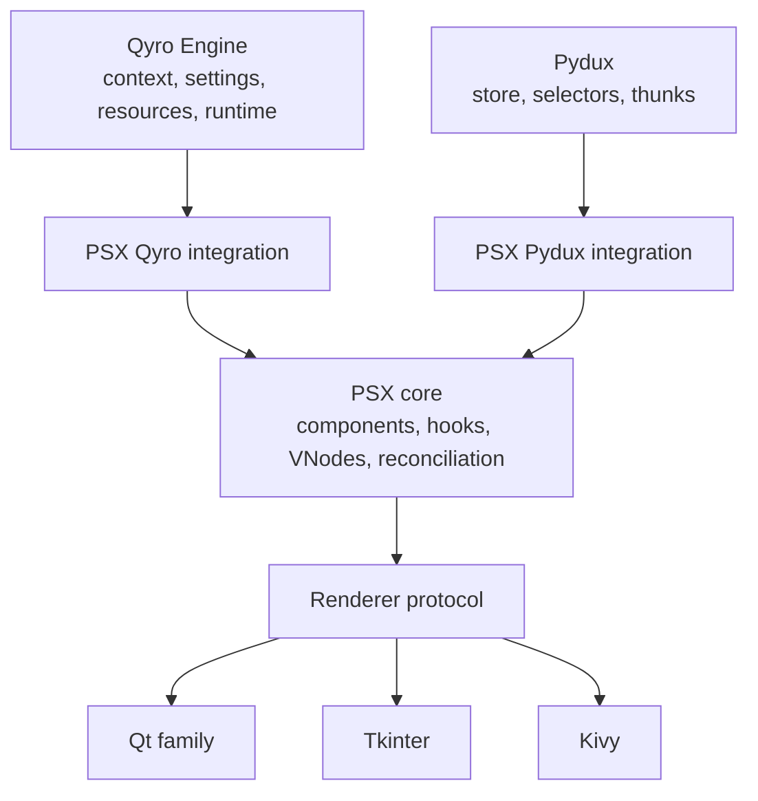

**Decision:** PSX owns a declarative UI description and its mounted-instance lifecycle. Qyro owns environment bootstrapping, framework configuration, resources, and application context. Pydux owns global state and its subscriptions. All integrations are optional extras and imports remain lazy.

**Trade-off:** the initial public API is smaller than the long-term vision, but it prevents an accidental replacement of either upstream library and keeps the PSX core testable without GUI packages.

## Component and tree model

The Python API and markup API produce the same immutable description nodes:

```python
@dataclass(frozen=True, slots=True)
class VNode:
    kind: NodeKind                 # HOST, COMPONENT, FRAGMENT, TEXT
    type: HostType | ComponentType
    key: str | int | None
    props: Mapping[str, object]
    children: tuple["VNode", ...]
```

`VNode` deliberately has no native handle. A separate mounted `Instance` carries parent/child ownership, component hook state, the renderer-specific native handle(s), and disposer callbacks. This matters because one logical node may own a layout rather than a widget (notably Qt `Row`/`Column`) and because one Tk layout often needs a `Frame`.

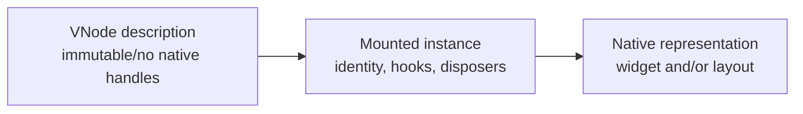

Host primitives are portable semantic tags, not backend widget names: `Column`, `Row`, `Text`, `Button`, and later `Grid`, `Overlay`, `PageStack`, and inputs. `Stack` will mean visual overlay; it will not alias Qt's page-selection layout. `PageStack` owns selection semantics.

## Rendering and reconciliation

The reconciler operates only on VNodes and `Renderer` operations. It never branches on a renderer name.

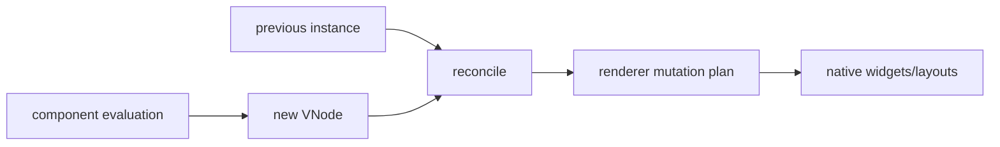

The first algorithm is intentionally conservative and predictable:

1. Replace when node kind/type differs.
2. Update changed portable props and event-slot targets in place when type matches.
3. Reconcile keyed children by `(kind, type, key)` identity, moving existing mounted instances as needed.
4. Reconcile unkeyed runs positionally; insert/remove at the tail or replacement point.
5. Unmount children in reverse ownership order and run every disposer exactly once.

This is a minimum-reasonable-mutations policy, not a claim of mathematically optimal diffing. Duplicate keys are a render error in development mode. Component identity is its function plus position/key; changing a key deliberately resets hook state.

The required renderer protocol is capability-oriented: create/update/remove a host representation; insert, remove, and move logical children; bind/update/unbind event slots; schedule work on the UI thread; and destroy native ownership. The exact protocol is introduced only after a headless test renderer fixes these semantics.

## Lifecycle, hooks, and scheduler

Functional components use ordered hooks. A component instance owns a hook cursor; rendering a different number/order of hooks raises a development error. Initial scope is `use_state`, `use_ref`, and `use_effect`; memo and callback hooks wait until profiling proves their need.

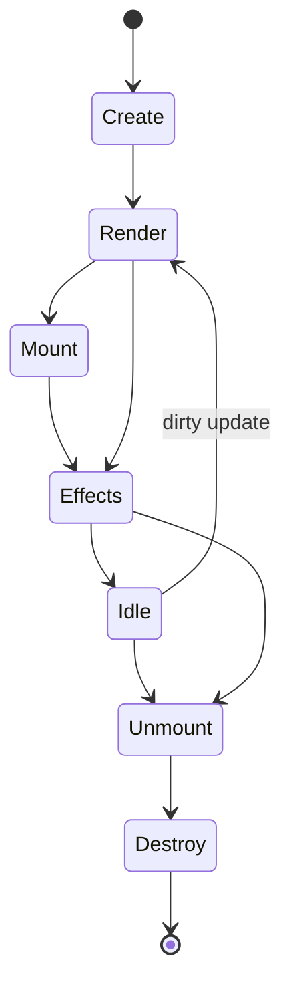

Effects run after renderer commits, never while evaluating a component. On dependency changes, the previous cleanup runs before the new effect. On unmount all effect cleanups, subscriptions, event bindings, timers and refs are disposed deterministically.

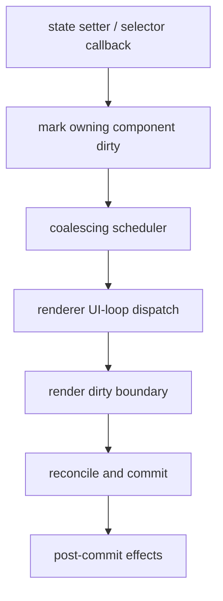

State setters accept a value or an updater. Multiple writes before the scheduled flush coalesce. Equality is `old is new or old == new` initially, with an escape hatch for explicit comparator selection later. The scheduler is renderer-owned at its edge: Qt uses the active binding's event queue, Tk uses `after_idle`, and Kivy uses `Clock.schedule_once`. All native mutation happens in that scheduled callback.

## Events and refs

Each mounted event prop creates one stable renderer connection to an `EventSlot`. Reconciliation changes only `EventSlot.callback`; it never reconnects merely because a lambda has a new identity.

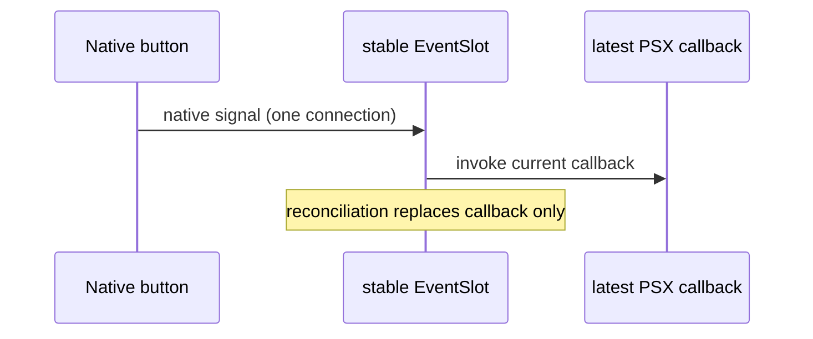

Unmount sets the slot inert and asks the renderer to disconnect/destroy the native binding. Portable event payloads are typed values (`str` for input changes, `bool` for checkbox changes), not Qt/Kivy/Tk event objects. Native escape hatches are a later renderer-specific API with explicit ownership and cleanup.

`use_ref()` stores a stable reference object. The renderer fills it after mount and clears it before final native destruction. A portable ref points to the mounted PSX host instance; a clearly named native-ref API may expose the native object where supported.

## PSX markup language

`psx()` will not introspect interpreter frames and will not `eval` arbitrary text. The runtime form takes an explicit lexical environment:

```python
psx("<Text>{count}</Text>", scope={"count": count})
```

The ergonomic final form is a static source transform which compiles a marked template into a factory with lexical references already represented as Python expressions. That transform preserves line/column source locations and does not make markup mandatory for Python-only components.

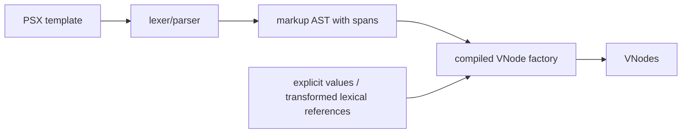

The parser will be a real grammar (e.g. a handwritten token stream or a parser library), not regular-expression substitution. Milestone 3 grammar covers elements, fragments, quoted/static attributes, brace expressions, text, self-closing elements, children, and source diagnostics. Collection and conditional rendering use ordinary Python expressions/children in the first design rather than introducing a second control-flow language.

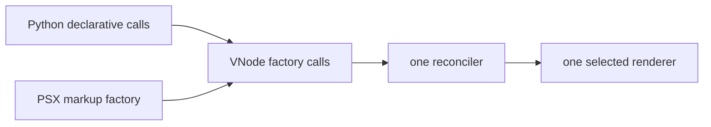

There are two trust modes:

* **Developer-authored compiled templates:** expressions are ordinary developer Python references compiled ahead of time. They are not a sandbox and must never process untrusted templates.
* **External/untrusted templates:** out of scope for v1. An AST whitelist is not a safe sandbox for arbitrary Python object graphs. Supporting these requires a separate non-Python expression language and security model.

Templates are parsed/compiled once per call site and cached by stable source identity. Static VNode subtrees may be hoisted only after profiling and only if their props/children are proven immutable.

## Qyro integration

Renderer resolution is explicit:

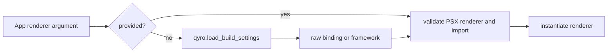

`App(Main, renderer="pyside6")` is standalone. `App(Main)` attempts the Qyro integration only when the optional dependency is installed; it calls public `qyro.load_build_settings()`, accepts the actual keys `binding` then `framework`, normalizes case, and reports a clear configuration/import error. It does not silently choose another renderer. An injected renderer always wins.

`use_qyro_context()` and `use_container()` must receive an explicitly supplied `ApplicationContext`/`EngineContainer` through an app provider, or a future Qyro mount adapter. They must not construct a container while rendering. Qyro's container constructor is public, but auto-creating it would create runtime side effects and is not appropriate for a hook.

```mermaid
sequenceDiagram
  participant A as Qyro ApplicationContext
  participant C as EngineContainer
  participant P as PSX App provider
  participant H as PSX hook
  A->>C: owns existing container
  A->>P: provide context/container reference
  P->>H: use_qyro_context/use_container
  Note over H: reads same instance; creates none
```

`use_resource` and settings conveniences are thin wrappers around Qyro public helpers. Settings are runtime configuration, not automatically reactive state. Hybrid mounting needs a dedicated adapter later; it must neither invoke Qyro `Component` lifecycle hooks nor assume that all Qyro components are Qt-only.

## Pydux integration

The app integration accepts an explicit `Store`; there is no PSX global-store singleton. `use_dispatch()` returns that store's `dispatch`. `use_selector(selector, equality_fn=None)` uses `Store.select`, retains the current selected value in hook state, marks only its owning component dirty, and registers the returned unsubscriber as hook cleanup.


Pydux may notify while holding its re-entrant store lock. The listener must do only local hook-state replacement and scheduler enqueueing—never render synchronously or mutate a widget. This also makes async thunk completion safe when it originates off the UI thread. PSX may reuse the same UI-loop mechanisms as Pydux's Qt/Tk/Kivy bridges, but it should not depend on Pydux's adapters.

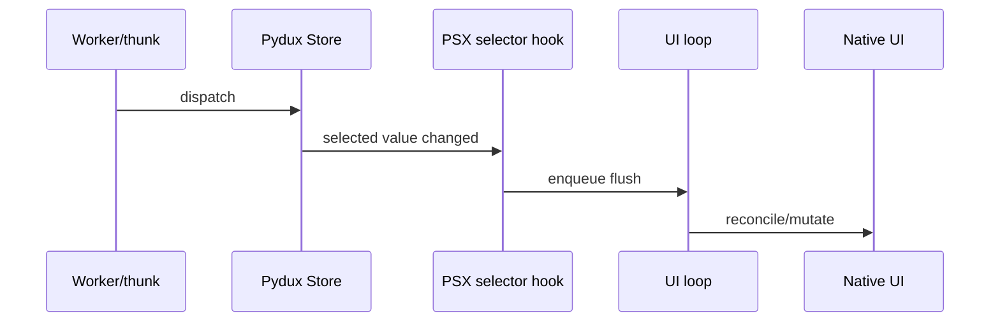

## Renderer plan and portability contract

PySide6 is the first production vertical slice because it is a Qyro CLI binding and has the richest existing Qyro support. Qt implementation is split into a binding-neutral renderer core and small binding loaders; a process must reject a request that conflicts with an already-imported Qt binding.

Tkinter is the second renderer and validation target: `Row`/`Column` must be representable using frames plus `pack`/`grid`, and layout props may have explicitly documented approximations. Kivy is third. Native styles (QSS, Kivy canvas, ttk themes) remain renderer-specific; portable styles and capabilities are separate, later layers.

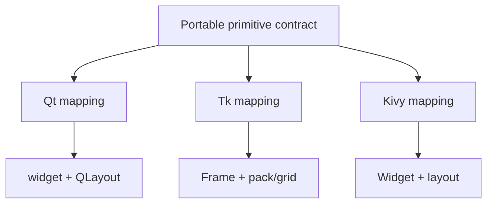

Capabilities are an honest runtime query rather than a portability promise. Unsupported portable props either have documented approximations or raise a capability error in strict mode. The core package imports no Qt, Kivy, Tkinter, Qyro, or Pydux modules at import time.

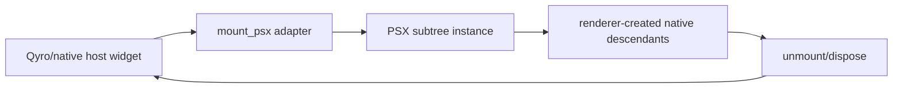

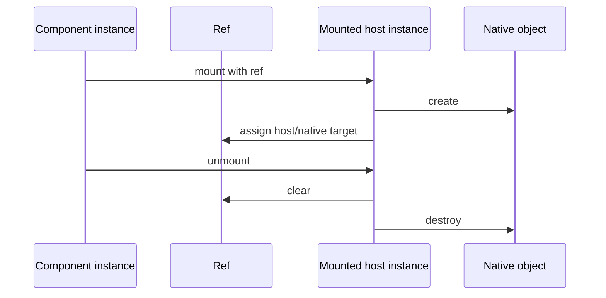

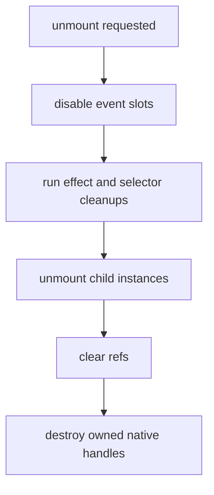

## Packaging and compatibility

Python 3.10 is the core floor, matching PSX's existing metadata and the broad Qyro direction. Extras should be finalized only once supported binding ranges are tested: likely `qt-pyside6`, `qt-pyqt6`, `qt-pyqt5`, `kivy`, `qyro`, and `pydux`. `tkinter` is normally a Python distribution feature, not a reliable pip extra. PySide2 appears in Qyro today but is not part of the requested initial PSX renderer set.

## Critical risks and rejected shortcuts

| Risk | Decision |
| --- | --- |
| Markup expression execution | Explicit scope/static transform; no frame inspection, `eval`, or claimed Python sandbox. |
| Duplicate signals from render lambdas | Stable slots, updated callbacks, deterministic disconnect. |
| UI update from worker/store thread | All reconciliation enters through the renderer scheduler. |
| Qt-specific core | Headless renderer tests first; Tkinter follows immediately after Qt slice. |
| Qyro lifecycle duplication | PSX mounts under an explicit host adapter and never drives Qyro's lifecycle methods. |
| Feature-driven overarchitecture | Commit only the core contracts required by the first vertical slice; extend after tests prove pressure. |

## D11 — Declarative layout system

`Row` and `Column` are portable semantic containers. `padding` and `spacing`
are the currently implemented contract; `align`, `justify`, `fill`, `Grid`,
`Overlay`, and flexible sizing are planned extensions, not silently accepted
props. Renderers use native layout engines: Qt uses layouts, Tkinter uses
`ttk.Frame` plus `pack`, and Kivy will use its layouts. Tk spacing currently
includes an outer edge, unlike a CSS `gap`; this approximation is documented in
the M7 guide. PSX deliberately does not implement a CSS engine.

## D12 — Native widget interoperability

M10 will add explicit renderer-specific native-node adapters for widgets such
as `QWebEngineView`, `QOpenGLWidget`, custom `QWidget` subclasses, and
third-party controls. The adapter must define ownership, prop updates, event
binding, identity and disposal. Native handles are never inferred from a
portable VNode and PSX never destroys a borrowed host. M8 does not add this
surface.

## D13/D13.1/D14 — Playground, inspector and visual builder

M12 plans a browser playground and visual layout inspector. Its preview is a
semantic approximation and must not claim to run native Qt/Tk widgets. It will
show component trees, layout bounds, padding and spacing using D11 semantics.
M13 builds a drag-and-drop editor on those same representations and exports the
supported declarative PSX subset; it does not introduce a parallel layout model.

## D15 — intelligent hot reloading

M8 devtools are isolated in `psx.devtools` and are disabled by default. A
polling watcher debounces relevant project-source changes, ignores generated
paths, and sends them to a conservative classifier. The implemented baseline is
`PROCESS_RESTART`: a supervisor owns a child process, stops it cleanly, then
starts one replacement. It never imports or reloads the application itself.

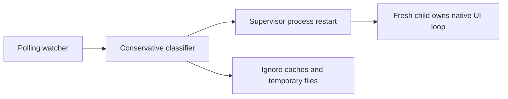

This avoids stale `from module import name` bindings, closures, native toolkit
state and arbitrary extension reload. In-process component hot update and safe
module rebind are explicitly deferred until mounted component identity/hook
compatibility can be proven. Optional JSON-only, versioned state snapshots are
available to application code but are not automatically restored by the first
supervisor slice. Hot reload is hard-disabled for frozen runtimes and requires
both `enabled=True` and `development=True`.

## Validation gates before implementation expansion

1. A headless renderer must prove keyed identity, prop-only updates, event-slot replacement, cleanup, and hooks without a GUI.
2. PySide6 must demonstrate that a text update calls an in-place label update and preserves the same button object and one signal connection.
3. A parser test suite must cover malformed tags, source spans, attributes, interpolation, fragments, and cache reuse.
4. Pydux integration must prove one selector change schedules one owning component and cleanup unsubscribes on unmount.
5. Qyro integration must prove public-helper renderer selection and explicit errors for missing configuration/binding.
