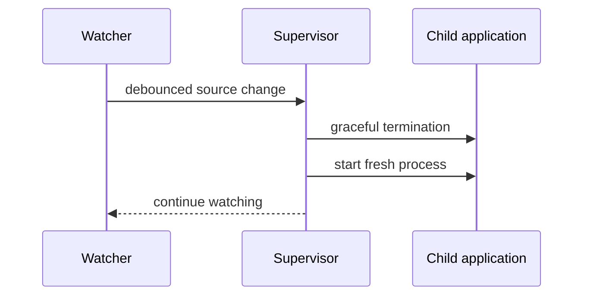

# M8 — Intelligent Hot Reloading

**Status:** vertical slice implemented. **Production:** disabled by default.

`psx.devtools` provides a conservative development supervisor. Run an entry
point with:

```bash
psx-dev path/to/main.py
# or: python -m psx.devtools path/to/main.py
```

The supervisor starts a child process, polls the project tree, debounces changes
and restarts the child for project Python, dependency manifest or native-library
changes. It ignores virtual environments, caches, build output and temporary
editor files. The child is the only process that owns a native UI event loop.

For importable, project-owned component modules, `ComponentRefreshManager`
reloads the module and queues its already-mounted component boundaries through
the existing renderer scheduler. `@component` preserves the definition identity
by module and qualified name across that compatible reload, so normal
reconciliation updates text/props and event slots in place rather than closing
the window. A changed hook structure or entry-point/bootstrap module remains a
restart fallback.



`HotReloadConfig` is enabled for a development runtime unless explicitly opted
out, and checks frozen runtime status internally (including Qyro when available). The
optional `StateSnapshotRegistry` accepts only explicitly registered,
versioned JSON data with a size limit. It never serializes widgets, closures,
threads, handles, credentials or pickle payloads.

## Deliberate limitations

The runtime reloads only explicitly selected, importable project component
modules. It never blindly reloads third-party packages, entry-point bootstrap
code, native extensions, arbitrary `from module import symbol` consumers or
module singletons. Those changes use `PROCESS_RESTART`. Automatic file-to-module
tracking, automatic snapshot restore and richer source-map diagnostics are
follow-up work.

`PSXComponent` enables compatible refresh automatically for Qyro windows. When
Qyro reports a non-frozen runtime, it watches the authored source supplied by
`qyro start`, recompiles M4B factories, swaps the compatible `render` method
and schedules the mounted boundary. No demo edit or explicit opt-in is needed.
Candidate loading retains existing globals and executes only factories plus the
component class, so an existing Pydux store is not recreated. Set
`PSX_HOT_RELOAD=0` or `PSX_ENV=production` to opt out.

PSX discovers static imports that resolve to `.py` files under the project root,
including nested modules such as `features.view` and `services.api`. A new local
module therefore requires no settings change: import it from project source and
it joins the reload graph automatically. Projects can refine that default in
`settings/base.json`:

```json
{
  "hot_reload": {
    "enabled": true,
    "watch": ["src/", "app/"],
    "module_reload": {
      "include": ["app.*", "services.*"],
      "exclude": ["numpy.*", "PySide6.*"],
      "third_party": "restart"
    },
    "preserve_state": true,
    "fallback": "restart"
  }
}
```

`include` adds local modules even when no current import reaches them; `exclude`
has priority; `watch` limits extra watched directories while the entry always
remains watched. `third_party: "restart"` records the conservative policy for
non-project dependencies. `preserve_state` applies only to compatible component
refresh; snapshot restore remains opt-in. When a discovered local module
changes, PSX reloads it before rebuilding the Qyro render method, so
`from md import hi` is rebound to the current symbol. Third-party packages,
native extensions and bootstrap code do not receive an in-process reload
guarantee.

Tests cover debounce, atomic saves, ignored paths, supervisor restart, JSON
snapshot validation and production disable. Syntax failures in a child do not
kill the watcher; saving a subsequent source change starts another child.
