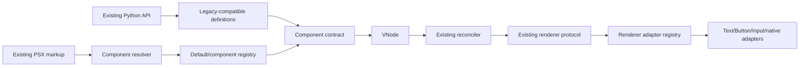

# REF-M0 decisions

1. Preserve the current public API exactly. Contract, registry, resolver and adapter APIs are internal first; any public extension API is additive.
2. Keep a default built-in registry transparent. Existing imports and markup must resolve built-ins with no registration step.
3. Preserve `ComponentType` hot-reload identity. A markup registry resolves component definitions; it must not become a second identity system.
4. Preserve `VNode`, reconciliation compatibility `(kind, type, key)`, `MountedInstance`, refs, `EventSlot`, hooks and scheduler behavior during the adapter migration.
5. Make cache keys account for resolver/registry identity or version before compiler decoupling. Using a template compiled for another registry is invalid.
6. Treat existing baseline failures as blockers to declaring a later milestone fully green. Do not rewrite tests to hide them.
7. REF-M1 contracts keep an explicit builder-validation hook because `Input` historically presents different public error types/messages than renderer validation. Compatibility diagnostics are part of its contract until a separately reviewed, backward-compatible normalization path exists.
8. REF-M2 uses instance-scoped registries and a `builtin_component_registry()` factory instead of a mutable global. This preserves isolation for external libraries and allows built-ins to remain transparent when REF-M3 adopts the registry.
9. REF-M2 does not wire the registry into markup. Compiler resolution, source transformation and template caching remain unchanged until REF-M3, where registry versioning will be part of cache correctness.

## Target architecture

## Ordered migration plan

1. REF-M1: introduce contracts and delegate built-in builders without changing signatures, defaults, validation or errors.
2. REF-M2: add a default registry populated automatically with built-ins; retain component reload identity.
3. REF-M3: replace compiler primitive tables and tag special cases behind a resolver; retain parser, AST, source locations, static transform and cache behavior.
4. REF-M4: add renderer-local adapters behind the unchanged reconciliation protocol; prove handle identity, event replacement and cleanup.
5. REF-M5–M7: expose native extension seams, then an additive public extension API, then implement Checkbox solely through those seams.
6. REF-M8–M9: finalize developer documentation and repeat all available compatibility, integration and benchmark checks.
