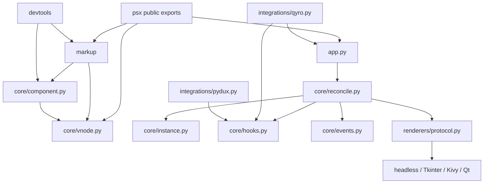

# REF-M0 dependency map

Core imports no GUI backend directly. Renderer loading is lazy in `App`, and the Qyro/Pydux integrations retain optional imports. The main dependency inversion issue is semantic rather than import-level: component knowledge is replicated in the compiler and concrete renderers.

Migration seam: add contracts and a resolver below the legacy builder/markup functions; add adapter lookup behind the existing renderer protocol. Keep `Reconciler`, VNode shape, compatibility matching, `EventSlot`, and hook scheduling stable while adapters are introduced.
